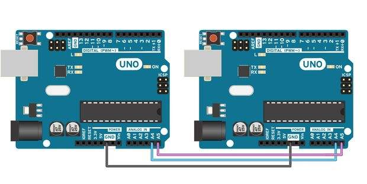
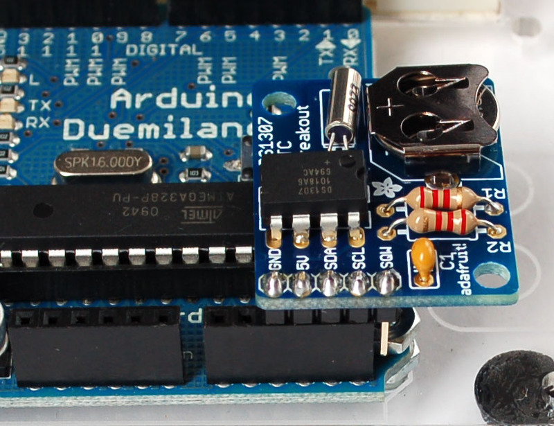

# Arduino notes

This is based on Arduino 1.6.6 but holds true for most other Arduino IDEs.

## Avoid Delay, please

[Src](http://playground.arduino.cc/Code/AvoidDelay)

The delay() function stops the entire code execution on the Arduino. Except for interrupts.
Thus during that time buttons, LEDs and other things you might want to check do not work any more.
delay() can be used if you are only checking one sensor and want to make sure you have a "frozen" condition just before polling.

Using millis() also allows us to very easily understand what a state machine is.
As the name suggests, a state machine is a box who knows what the current state of something is.
In your example we need a state machine for two LEDs.


## SDA (DAT) and SCL (CLK)

The Signal Data and Signal Clock lines can be found on your Arduino at various places.
The SCL on Arduino UNO its Analog #5, on the Leonardo its Digital #3, on the Mega its digital #21
The SDA on Arduino UNO its Analog #4, on the Leonardo its Digital #2, on the Mega its digital #20
Adafruit Flora has it labelled as such but can also serve as a Digital pin.

Here is a quick table

| Board              |  I²C / TWI pins                                  |
|--------------------|--------------------------------------------------|
| Uno, Ethernet |   A4 (SDA), A5 (SCL)                         |
| Mega2560       | 20 (SDA), 21 (SCL)                           |
| Leonardo         | 2 (SDA), 3 (SCL)                               |
| Due                  |20 (SDA), 21 (SCL), SDA1, SCL1     |

[Src](https://www.arduino.cc/en/Reference/Wire)

## I²C, SPI, TWI etc

[Some details in the Wire Arduino Library](https://www.arduino.cc/en/Reference/Wire)

### Serial Peripheral Interface

[Src](https://www.arduino.cc/en/Reference/SPI)

Serial Peripheral Interface (SPI) is a synchronous serial data protocol used by microcontrollers for communicating with one or more peripheral devices quickly over short distances. It can also be used for communication between two microcontrollers.

With an SPI connection there is always one master device (usually a microcontroller) which controls the peripheral devices. Typically there are three lines common to all the devices:

MISO (Master In Slave Out) - The Slave line for sending data to the master,
MOSI (Master Out Slave In) - The Master line for sending data to the peripherals,
SCK (Serial Clock)               - The clock pulses which synchronize data transmission generated by the master

and one line specific for every device:
SS (Slave Select)                 - The pin on each device that the master can use to enable and disable specific devices.

When a device's Slave Select pin is low, it communicates with the master. When it's high, it ignores the master. This allows you to have multiple SPI devices sharing the same MISO, MOSI, and CLK lines.

For more on SPI, see [Wikipedia's page on SPI](https://en.wikipedia.org/wiki/Serial_Peripheral_Interface_Bus).

The following table display on which pins the SPI lines are broken out on the different Arduino boards:

| Arduino Board                |  MOSI               |       MISO         | SCK                  | SS (slave)  | SS (master) |
|----------------------------------|---------------------|----------------------|----------------------|----------------|------------------|
| Uno or Duemilanove       | 11 or ICSP-4    |  12 or ICSP-1   |  13 or ICSP-3   | 10               | -                   |
| Mega1280 or Mega2560 |   51 or ICSP-4  |    50 or ICSP-1 |   52 or ICSP-3  |  53              | -                   |
| Leonardo                         | ICSP-4             |  ICSP-1             | ICSP-3             |  -                | -                   |
| Due                                 | ICSP-4              | ICSP-1             | ICSP-3              |  -                | 4, 10, 52      |

On the ICSP header we have a consistent layout

| PIN | Function |
|-------|-------------|
| 1     | MISO      |
| 2     | +VCC     |
| 3     | SCK       |
| 4     | MOSI     |
| 5     | Reset     |
| 6     | GND      |


### Inter-Integrate Circuit (I squared C)

With the [I²C](http://en.wikipedia.org/wiki/I2C) protocol we can "daisy-chain" Arduinos.

To connect 2 Arduino UNOs connect Pin **A4** and **A5** between the two.
You also need a common Ground so connect GND too.



### TWI

TWI-Bus or Two Wire Interface, a variant of I²C

## Variables

### U & L formatters

[Src](https://www.arduino.cc/en/Reference/IntegerConstants)

To force a cast on a number just append a formatter.
Like to make *1000* an unsigned long, write it as *1000UL*

By default, an integer constant is treated as an [int](https://www.arduino.cc/en/Reference/Int) with the attendant limitations in values. To specify an integer constant with another data type, follow it with:

* a 'u' or 'U' to force the constant into an unsigned data format. Example: 33u
* a 'l' or 'L' to force the constant into a long data format. Example: 100000L
* a 'ul' or 'UL' to force the constant into an unsigned long constant. Example: 32767ul


## Constants

Micro-controllers like the Arduino UNO have a maximal program storage space e.g 32,256 for the UNO
Switching an integer to a constant integer saves us 4 bytes. You should get into the habit of making PIN variables or other variables that do not change in your program constants or define them as such.

Use either const byte, const int or #define to achieve this goal.

Personally I find it awkward reading *const int myPin = A0;* A0 Does not really look like an integer.
\#defines are perhaps a better choice for readability and general cleanliness.

##### Research difference define const

## Scope

When programming an Arduino pay attention to the Variable scope. As a rule of thumb try to declare your variables outside of any functions. This makes them Global. If no other good reason exists try to stick to this.
As always, do not re-use variable names in different scopes, it will confuse you. And if it doesn't confuse you it might confuse the next person to read your code.

## Functions

[Src](https://www.arduino.cc/en/Reference/FunctionDeclaration)

```processing
void setup(){
  Serial.begin(9600);
}

void loop() {
  int i = 2;
  int j = 3;
  int k;

  k = myMultiplyFunction(i, j); // k now contains 6
  Serial.println(k);
  delay(500);
}

int myMultiplyFunction(int x, int y){
  int result;
  result = x * y;
  return result;
}
```

## switch case

[Src](https://www.arduino.cc/en/Reference/SwitchCase)

```processing
switch (var) {
    case 1:
      //do something when var equals 1
      break;
    case 2:
      //do something when var equals 2
      break;
    default: 
      // if nothing else matches, do the default
      // default is optional
    break;
  }
```

## Calling analog read twice for high-Z

If you read anything about high or low Z, this usually means high or low impedance.

From this [Audio Imedance FAQ](http://www.deltamedia.com/resource/impedance.html)

### WHAT IS IMPEDANCE?
Impedance (Z) is the resistance of a circuit to alternating current, such as an audio signal. Technically, impedance is the total opposition (including resistance and reactance) that a circuit has to passing alternating current.
A high impedance circuit tends to have high voltage and low current. A low impedance circuit tends to have relatively low voltage and high current.

## Powering your projects from the pins

Some times you want to be able to easily plug in a break out board like below.



In this example the Arduino Duemillanova has been programmed that analog pin 3 (digital 17) is an *OUTPUT* and **HIGH** and analog pin 2 (digital 16) an *OUTPUT* and **LOW**. SDA is is connected to analog pin 4 and analog pin 5 is SCL.

Obvious once you think abut it.

LOW == GND
HIGH == 5V

## Real Time Clock (RTC)

A good guide can be found [here](https://learn.adafruit.com/ds1307-real-time-clock-breakout-board-kit?view=all)

## Multi tasking the Arduino

The Adafruit Learning platform has a nice 3 parter

* [Multi-Tasking the Arduino Part 1](https://learn.adafruit.com/multi-tasking-the-arduino-part-1?view=all)
* [Multi-Tasking the Arduino Part 2](https://learn.adafruit.com/multi-tasking-the-arduino-part-2?view=all)
* [Multi-Tasking the Arduino Part 3](https://learn.adafruit.com/multi-tasking-the-arduino-part-3?view=all)
